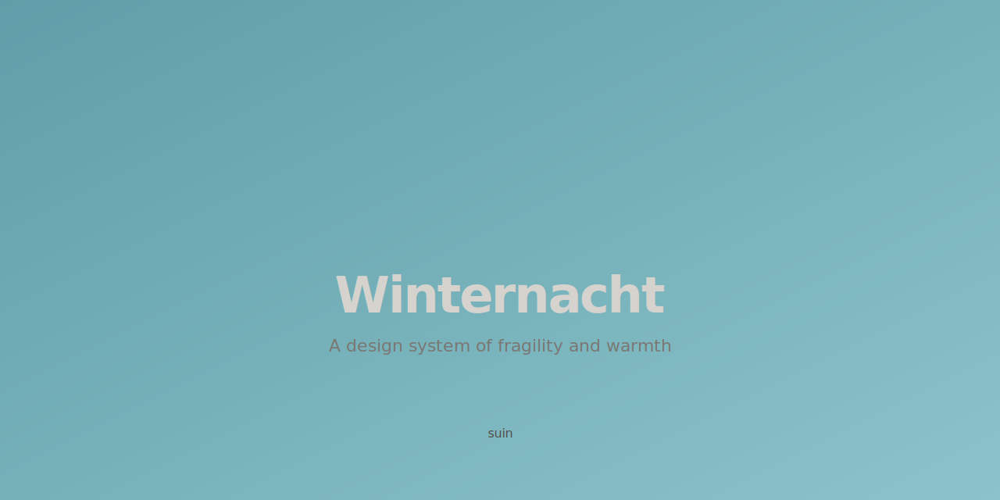

<h1 align="center">Winternacht</h1>

<p align="center">
  <strong>A design system of fragility and warmth.</strong>
</p>

<p align="center">
  
</p>

---

## Philosophy

| Principle | |
|---|---|
| **Fragility** | Delicate enough to vanish. It doesn't assert — it simply exists. |
| **Kindness** | Every touchpoint welcomes gently. |
| **Intention** | No decoration without reason. |
| **Consistency** | Blog, slides, social, business card — the same quiet air. |

---

## What's Inside

Winternacht provides a unified palette of 10 chromatic scales (Accent, Sage, Sand, Clay, Lavender, Slate, Mint, Rose, Copper, Neutral), a typography system built on [Inter](https://rsms.me/inter/) and [JetBrains Mono](https://www.jetbrains.com/lp/mono/), design tokens for spacing, radii, motion, and shadows, plus component patterns for buttons, tags, cards, code blocks, and more — all designed to carry the same quiet air from blog to business card.

See [`design-system.md`](design-system.md) for the full specification.

---

## Editor Themes

### VS Code

> *Winternacht Dark* and *Winternacht Light*

Install from the [VS Code Marketplace](https://marketplace.visualstudio.com/items?itemName=suin.winternacht-by-suin), or:

```
ext install suin.winternacht-by-suin
```

---

## Markdown Preview Enhanced

A custom theme for [Markdown Preview Enhanced](https://github.com/shd101wyy/vscode-markdown-preview-enhanced) with light/dark mode support, rainbow heading colors, Mermaid diagram theming, and full syntax highlighting using the Winternacht palette.

See [`vscode-markdown-preview-enhanced/`](vscode-markdown-preview-enhanced/) for setup instructions.

---

## License

MIT

---

<sub>Built with intention. Designed for the quiet night.</sub>
