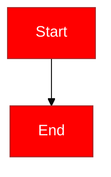

# Markdown Preview Enhanced: Style Customization & Sharing

## Overview

[Markdown Preview Enhanced](https://github.com/shd101wyy/vscode-markdown-preview-enhanced) (MPE) provides a layered system for customizing the preview appearance. The rendering engine is powered by the [crossnote](https://github.com/shd101wyy/crossnote) library.

---

## Part 1: How to Customize Styles

### 1.1 The `.crossnote` Configuration Directory

Customization lives in a `.crossnote` directory at two levels:

| Level | Location |
|---|---|
| **Global** | `~/.config/crossnote/` (macOS/Linux), `%USERPROFILE%\.crossnote\` (Windows) |
| **Workspace** | `<workspace>/.crossnote/` |

Each `.crossnote` directory can contain four configuration files:

| File | Purpose |
|---|---|
| `style.less` | Custom CSS/LESS styles for the preview |
| `config.js` | JavaScript configuration (KaTeX macros, MathJax, Mermaid, etc.) |
| `head.html` | Custom HTML injected into the `<head>` of the preview |
| `parser.js` | Custom markdown parser hooks (pre/post processing) |

Both global and workspace `style.less` files are loaded simultaneously, with the **workspace version taking higher priority**.

### 1.2 Custom CSS via `style.less`

This is the primary customization mechanism. Access it via the Command Palette:

- `Markdown Preview Enhanced: Customize CSS (Global)`
- `Markdown Preview Enhanced: Customize CSS (Workspace)`

The file uses **LESS syntax**. The key selector is `.markdown-preview.markdown-preview` (doubled for specificity):

```less
.markdown-preview.markdown-preview {
  color: blue;
  font-size: 14px;

  // Custom PDF output style
  @media print {
  }

  // Custom Prince PDF export style
  &.prince {
  }

  // Custom presentation (reveal.js) style
  .reveal .slides {
  }
}

// Sidebar TOC style
.md-sidebar-toc.md-sidebar-toc {
}
```

**Custom fonts example:**

```less
@font-face {
  font-family: "your-font-family";
  src: url("your-font-file-url");
}

.markdown-preview.markdown-preview {
  font-family: "your-font-family", sans-serif;

  h1, h2, h3, h4, h5, h6, pre, code {
    font-family: "your-font-family", sans-serif;
  }
}
```

After modifying, click the **refresh button** at the top-right corner of the preview pane to recompile.

### 1.3 Built-in Preview Themes

**Setting:** `markdown-preview-enhanced.previewTheme`
**Default:** `"github-light.css"`

17 themes available:

| Theme | Description |
|---|---|
| `atom-dark.css` | Atom editor dark theme |
| `atom-light.css` | Atom editor light theme |
| `atom-material.css` | Material design for Atom |
| `github-dark.css` | GitHub dark mode |
| `github-light.css` | GitHub light mode (default) |
| `gothic.css` | Gothic serif style |
| `medium.css` | Medium.com-inspired |
| `monokai.css` | Monokai color scheme |
| `newsprint.css` | Newspaper print style |
| `night.css` | Dark night theme |
| `none.css` | No theme (blank slate for full custom styling) |
| `one-dark.css` | One Dark |
| `one-light.css` | One Light |
| `solarized-dark.css` | Solarized Dark |
| `solarized-light.css` | Solarized Light |
| `vue.css` | Vue.js documentation style |

Theme source files are LESS files in the crossnote repo at [`styles/preview_theme/`](https://github.com/shd101wyy/crossnote/tree/master/styles/preview_theme). They use a parameterized mixin pattern:

```less
// github-light.less
@import 'github.less';

html {
  .github(#333, #fff, #08c); // foreground, background, accent
}
```

**Tip:** Setting `previewTheme` to `none.css` disables all built-in themes, giving a blank canvas for fully custom theming.

### 1.4 Code Block Syntax Highlighting (Prism.js)

MPE uses **Prism.js** for syntax highlighting in code blocks. There are multiple layers of customization.

#### 1.4.1 Built-in Code Block Themes

**Setting:** `markdown-preview-enhanced.codeBlockTheme`
**Default:** `"auto.css"` (automatically matches the preview theme)

24 themes available: `auto.css`, `default.css`, `atom-dark.css`, `atom-light.css`, `atom-material.css`, `coy.css`, `darcula.css`, `dark.css`, `funky.css`, `github.css`, `github-dark.css`, `hopscotch.css`, `monokai.css`, `okaidia.css`, `one-dark.css`, `one-light.css`, `pen-paper-coffee.css`, `pojoaque.css`, `solarized-dark.css`, `solarized-light.css`, `twilight.css`, `vs.css`, `vue.css`, `xonokai.css`

Theme source files are located at [`crossnote/styles/prism_theme/`](https://github.com/shd101wyy/crossnote/tree/master/styles/prism_theme). Some are plain `.css`, others are `.less` files using LESS variables.

#### 1.4.2 Prism.js Token Classes

Prism.js parses code and wraps each token in a `<span class="token {type}">`. The full set of token classes used across the built-in themes:

| Token Class | Typical Usage |
|---|---|
| `.token.comment` | Comments |
| `.token.prolog` | XML prolog |
| `.token.doctype` | DOCTYPE declarations |
| `.token.cdata` | CDATA sections |
| `.token.punctuation` | Brackets, semicolons, etc. |
| `.token.property` | CSS properties, object properties |
| `.token.tag` | HTML/XML tags |
| `.token.boolean` | `true`, `false` |
| `.token.number` | Numeric literals |
| `.token.constant` | Constants |
| `.token.symbol` | Symbols |
| `.token.deleted` | Diff deleted lines |
| `.token.selector` | CSS selectors |
| `.token.attr-name` | HTML attribute names |
| `.token.string` | String literals |
| `.token.char` | Character literals |
| `.token.builtin` | Built-in types/functions |
| `.token.inserted` | Diff inserted lines |
| `.token.operator` | Operators (`+`, `-`, `=`, etc.) |
| `.token.entity` | HTML entities |
| `.token.url` | URLs |
| `.token.atrule` | CSS at-rules (`@media`, etc.) |
| `.token.attr-value` | HTML attribute values |
| `.token.keyword` | Language keywords |
| `.token.function` | Function names |
| `.token.function-name` | Function declarations |
| `.token.class-name` | Class names |
| `.token.variable` | Variables |
| `.token.regex` | Regular expressions |
| `.token.important` | Important markers |
| `.token.bold` | Bold text (font-weight: bold) |
| `.token.italic` | Italic text (font-style: italic) |
| `.namespace` | Namespace prefixes (opacity: 0.7) |

#### 1.4.3 Custom Syntax Highlighting via `style.less`

You can override any Prism token color in `.crossnote/style.less`. The selectors must be nested inside `code[class*='language-'], pre[class*='language-']`:

```less
.markdown-preview.markdown-preview {
  // Override code block background
  pre {
    background-color: #1a1b26 !important;
    border: none;
    border-radius: 8px;
  }

  // Override syntax highlighting token colors
  code[class*='language-'],
  pre[class*='language-'] {
    color: #a9b1d6; // default text color

    .token.comment,
    .token.prolog,
    .token.doctype,
    .token.cdata {
      color: #565f89;
    }

    .token.punctuation {
      color: #9aa5ce;
    }

    .token.keyword,
    .token.atrule,
    .token.attr-value {
      color: #bb9af7;
    }

    .token.string,
    .token.char {
      color: #9ece6a;
    }

    .token.number,
    .token.boolean,
    .token.constant {
      color: #ff9e64;
    }

    .token.function {
      color: #7aa2f7;
    }

    .token.class-name {
      color: #e0af68;
    }

    .token.variable {
      color: #c0caf5;
    }

    .token.operator {
      color: #89ddff;
    }

    .token.tag {
      color: #f7768e;
    }

    .token.attr-name {
      color: #bb9af7;
    }

    .token.regex {
      color: #b4f9f8;
    }
  }
}
```

#### 1.4.4 Writing a Complete Custom Prism Theme

For maximum control, set `codeBlockTheme` to `"default.css"` (a minimal theme) and write a full theme in `style.less`. The built-in theme LESS files follow this structure (from `one-dark.less`):

```less
// 1. Define color palette as LESS variables
@hue-1: hsl(187, 47%, 55%);  // cyan
@hue-2: hsl(207, 82%, 66%);  // blue
@hue-3: hsl(286, 60%, 67%);  // purple
@hue-4: hsl(95, 38%, 62%);   // green
@hue-5: hsl(355, 65%, 65%);  // red
@hue-6: hsl(29, 54%, 61%);   // orange

// 2. Style the <pre> block (background, font, padding, border)
pre {
  color: @syntax-text-color;
  background-color: @syntax-background-color !important;
  // ...
}

// 3. Map tokens to colors
code[class*='language-'],
pre[class*='language-'] {
  .token.comment { color: @mono-3; }
  .token.keyword { color: @hue-3; }
  .token.string  { color: @hue-4; }
  .token.function { color: @hue-2; }
  // ...
}

// 4. Optional: line highlight styles
pre[data-line] .line-highlight {
  background: hsla(24, 20%, 50%, 0.08);
}
```

#### 1.4.5 Inline Code Styling

Inline code (`` `code` ``) is styled separately from code blocks. Override it via:

```less
.markdown-preview.markdown-preview {
  code {
    color: #e06c75;
    background-color: #2c313a;
    padding: 0.2em 0.4em;
    border-radius: 3px;
    font-size: 85%;
  }
}
```

### 1.5 Mermaid Diagram Styling

MPE embeds [Mermaid.js](https://mermaid.js.org/) for rendering diagrams (flowcharts, sequence diagrams, Gantt charts, etc.). There are multiple customization approaches.

#### 1.5.1 Built-in Mermaid Themes

**Setting:** `markdown-preview-enhanced.mermaidTheme`
**Default:** `"default"`

Available values: `default`, `forest`, `dark`, `neutral`, `null`

Setting `"null"` disables the built-in Mermaid theme entirely, useful when you want full CSS control.

The theme is set during Mermaid initialization in the preview. From the crossnote source (`src/markdown-engine/index.ts`):

```javascript
var MERMAID_CONFIG = ({...});
MERMAID_CONFIG.startOnLoad = false;
MERMAID_CONFIG.cloneCssStyles = false;
MERMAID_CONFIG.theme = "default"; // ← from mermaidTheme setting
mermaid.initialize(MERMAID_CONFIG);
```

#### 1.5.2 Mermaid Configuration via `config.js`

The `.crossnote/config.js` file accepts a `mermaidConfig` object that is passed directly to `mermaid.initialize()`. This supports the full [Mermaid configuration API](https://mermaid.js.org/config/schema-docs/config.html):

```javascript
({
  mermaidConfig: {
    startOnLoad: false,
    // Use 'base' theme + themeVariables for full color control
    theme: "base",
    themeVariables: {
      // General
      primaryColor: "#3b4252",
      primaryTextColor: "#eceff4",
      primaryBorderColor: "#4c566a",
      lineColor: "#88c0d0",
      secondaryColor: "#434c5e",
      tertiaryColor: "#2e3440",

      // Fonts
      fontFamily: "Inter, sans-serif",
      fontSize: "14px",

      // Flowchart
      nodeBorder: "#81a1c1",
      mainBkg: "#3b4252",
      nodeTextColor: "#eceff4",
      clusterBkg: "#2e3440",
      clusterBorder: "#4c566a",
      edgeLabelBackground: "#3b4252",

      // Sequence diagram
      actorBkg: "#3b4252",
      actorBorder: "#88c0d0",
      actorTextColor: "#eceff4",
      signalColor: "#eceff4",
      signalTextColor: "#eceff4",
      activationBorderColor: "#88c0d0",

      // Gantt chart
      sectionBkgColor: "#3b4252",
      taskBkgColor: "#5e81ac",
      taskTextColor: "#eceff4",
      taskBorderColor: "#81a1c1",

      // Git graph
      git0: "#88c0d0",
      git1: "#81a1c1",
      git2: "#5e81ac",
      git3: "#b48ead",
      gitBranchLabel0: "#eceff4",

      // Pie chart
      pie1: "#88c0d0",
      pie2: "#81a1c1",
      pie3: "#5e81ac",
      pie4: "#b48ead",
    },
  },
})
```

**Key insight:** Setting `theme: "base"` and using `themeVariables` gives you the most fine-grained control. The `"base"` theme applies your variables directly without any built-in color adjustments.

The full list of Mermaid theme variables is documented at: https://mermaid.js.org/config/theming.html

#### 1.5.3 Per-Diagram Styling with Directives

Mermaid supports inline `%%{init: {...}}%%` directives at the top of each diagram to override configuration per diagram:

````markdown

````

This overrides the global Mermaid config for that specific diagram only.

#### 1.5.4 Mermaid CSS Overrides via `style.less`

Mermaid renders SVG elements with specific CSS classes. You can override these in `style.less`:

```less
.markdown-preview.markdown-preview {
  // Flowchart nodes
  .mermaid {
    .node rect,
    .node circle,
    .node polygon {
      fill: #3b4252;
      stroke: #88c0d0;
    }

    .nodeLabel {
      color: #eceff4;
    }

    // Edges / arrows
    .edgePath .path {
      stroke: #88c0d0;
    }

    .edgeLabel {
      background-color: #2e3440;
      color: #d8dee9;
    }

    // Cluster (subgraph) boxes
    .cluster rect {
      fill: #2e3440;
      stroke: #4c566a;
    }

    .cluster text {
      fill: #eceff4;
    }

    // Sequence diagram
    .actor {
      fill: #3b4252;
      stroke: #88c0d0;
    }

    text.actor > tspan {
      fill: #eceff4;
    }

    .sequenceNumber {
      fill: #eceff4;
    }

    // General text
    text {
      fill: #d8dee9;
    }
  }
}
```

**Important:** CSS overrides may conflict with Mermaid's theme system. For best results, either:
- Use `themeVariables` in `config.js` (recommended for color changes), or
- Set `mermaidTheme` to `"null"` and use CSS overrides for full control

#### 1.5.5 How Mermaid Interacts with the Preview Theme

Mermaid diagrams are rendered as SVGs **inside** the preview container, but they have their own independent theme system. The `mermaidTheme` VS Code setting and the `previewTheme` setting are completely separate -- changing the preview theme does **not** automatically change the Mermaid theme.

For a cohesive look, you need to manually coordinate both themes (e.g., use `previewTheme: "night.css"` + `mermaidTheme: "dark"`).

### 1.6 Other Theme-Related Settings

| Setting Key | Default | Options |
|---|---|---|
| `previewColorScheme` | `"selectedPreviewTheme"` | `selectedPreviewTheme`, `systemColorScheme`, `editorColorScheme` |
| `mermaidTheme` | `"default"` | `default`, `dark`, `forest`, `neutral`, `null` |
| `revealjsTheme` | `"white.css"` | `beige.css`, `black.css`, `blood.css`, `league.css`, `moon.css`, `night.css`, `serif.css`, `simple.css`, `sky.css`, `solarized.css`, `white.css`, `none.css` |

### 1.7 Per-File Styling via Front-Matter and `@import`

Apply different styles per markdown file:

```markdown
---
id: "my-id"
class: "my-class1 my-class2"
---

@import "my-style.less"

# Heading1
Your content here...
```

In `my-style.less` (relative to the markdown file):

```less
#my-id {
  background-color: #222;
  color: #fff;

  h1, h2, h3, h4, h5, h6 {
    color: #fff;
  }
}
```

- `.less` files are compiled by the built-in LESS compiler
- `.css` files are included as `<link rel="stylesheet">` elements
- Alternative syntax: `<!-- @import "file.css" -->` or ``

### 1.8 `head.html` for External Resources

Inject arbitrary HTML into the preview's `<head>` for loading external CSS, fonts, or scripts:

```html
<link rel="stylesheet" href="https://fonts.googleapis.com/css2?family=Inter&display=swap">
<style>
  .markdown-preview.markdown-preview {
    font-family: 'Inter', sans-serif;
  }
</style>
```

### 1.9 Rendering Pipeline (Load Order)

1. Base styles from `styles/preview.less` (layout, scrollbar, sidebar TOC)
2. Preview theme (`previewTheme` setting)
3. Code block theme (`codeBlockTheme` setting)
4. Global `style.less`
5. Workspace `style.less` (higher priority)
6. Per-file `@import` styles (highest specificity via `id`/`class`)
7. `head.html` content injected into `<head>`

### 1.10 `parser.js` for HTML Transformation

Modify the rendered HTML programmatically (indirectly affecting styling):

```javascript
module.exports = {
  onDidParseMarkdown: async function(html) {
    // Add custom classes, wrap elements, etc.
    return html.replace(/<table>/g, '<table class="custom-table">');
  }
};
```

---

## Part 2: How to Share Custom Styles

### 2.1 No Official Theme Marketplace

MPE does **not** have a dedicated theme marketplace, plugin system for styles, or official mechanism for packaging/distributing themes. This was confirmed in [Issue #872](https://github.com/shd101wyy/markdown-preview-enhanced/issues/872).

### 2.2 Workspace `.crossnote` Directory (Best Method)

The most practical and officially supported way to share styles:

1. Run `Markdown Preview Enhanced: Customize CSS (Workspace)` to create `.crossnote/style.less`
2. Commit the entire `.crossnote/` directory to your Git repository
3. Anyone who clones the repo and has MPE installed gets the custom styles automatically

The `.crossnote/` folder can contain all four config files, making it a complete style package.

**This is ideal for:**
- Team-wide consistent styling
- Project-specific or client-specific branding
- Documentation repositories with a custom look

### 2.3 Sharing via GitHub Gists and Repositories

The community shares custom styles through:

- **GitHub Gists** -- e.g.:
  - [modeverv/eeeaa628...](https://gist.github.com/modeverv/eeeaa628ccf82130e4b5b81971b23b4f)
  - [sugitlab/226917e...](https://gist.github.com/sugitlab/226917e166384355f48fc14f9ef816e4)
- **GitHub Repositories** -- e.g., [chrisvaillancourt/markdown-preview-styles](https://github.com/chrisvaillancourt/markdown-preview-styles)
- **Blog posts** with shared configurations

To use a shared style, copy the `style.less` content into your own `.crossnote/style.less`.

### 2.4 Contributing Built-in Themes to Crossnote

To add a new built-in theme that ships with the extension:

1. Create a `.less` file in [crossnote's `styles/preview_theme/`](https://github.com/shd101wyy/crossnote/tree/master/styles/preview_theme)
2. Follow the existing mixin pattern
3. Submit a pull request to the crossnote repository
4. The theme must also be added to the `previewTheme` enum in the VS Code extension's `package.json`

There is no documented process for this, and the theme list has been relatively stable.

### 2.5 Full Custom Theme Distribution Strategy

For maximum control when sharing a theme:

1. Set `previewTheme` to `none.css` to disable built-in themes
2. Write a complete theme in `.crossnote/style.less`
3. Optionally use `.crossnote/head.html` for external resources
4. Distribute the `.crossnote/` directory (via Git, zip, or Gist)

Recipients place the `.crossnote/` folder in their workspace root, or copy `style.less` to their global config.

### 2.6 Per-File Style Distribution

Styles can travel with markdown files using `@import`:

```markdown
---
id: "winternacht-theme"
class: "dark-theme"
---

@import "themes/winternacht.less"
```

The `.less` file must be distributed alongside the markdown file (relative path).

---

## Summary: Key Paths & Commands

| Item | Path / Command |
|---|---|
| Global style.less | `~/.config/crossnote/style.less` (macOS/Linux) |
| Workspace style.less | `<workspace>/.crossnote/style.less` |
| Global config.js | `~/.config/crossnote/config.js` |
| Workspace config.js | `<workspace>/.crossnote/config.js` |
| head.html | `<workspace>/.crossnote/head.html` |
| parser.js | `<workspace>/.crossnote/parser.js` |
| Built-in theme sources | [crossnote/styles/preview_theme/](https://github.com/shd101wyy/crossnote/tree/master/styles/preview_theme) |
| Code block theme sources | [crossnote/styles/prism_theme/](https://github.com/shd101wyy/crossnote/tree/master/styles/prism_theme) |
| Open CSS (Global) | `Markdown Preview Enhanced: Customize CSS (Global)` |
| Open CSS (Workspace) | `Markdown Preview Enhanced: Customize CSS (Workspace)` |
| Open config.js | `Markdown Preview Enhanced: Open Config Script (Global/Workspace)` |
| Open parser.js | `Markdown Preview Enhanced: Extend Parser (Global/Workspace)` |

## VS Code Settings for Appearance

```jsonc
{
  "markdown-preview-enhanced.previewTheme": "github-light.css",
  "markdown-preview-enhanced.codeBlockTheme": "auto.css",
  "markdown-preview-enhanced.previewColorScheme": "selectedPreviewTheme",
  "markdown-preview-enhanced.mermaidTheme": "default",
  "markdown-preview-enhanced.revealjsTheme": "white.css",
  "markdown-preview-enhanced.printBackground": false,
  "markdown-preview-enhanced.enablePreviewZenMode": true
}
```

---

## Sources

- [Customize CSS Documentation](https://github.com/shd101wyy/markdown-preview-enhanced/blob/master/docs/customize-css.md)
- [Crossnote GitHub Repository](https://github.com/shd101wyy/crossnote)
- [Crossnote API Documentation](https://shd101wyy.github.io/crossnote/)
- [VS Code Extension package.json](https://github.com/shd101wyy/vscode-markdown-preview-enhanced/blob/master/package.json)
- [Theme Discussion - Issue #872](https://github.com/shd101wyy/markdown-preview-enhanced/issues/872)
- [Official Documentation Site](https://shd101wyy.github.io/markdown-preview-enhanced/)
